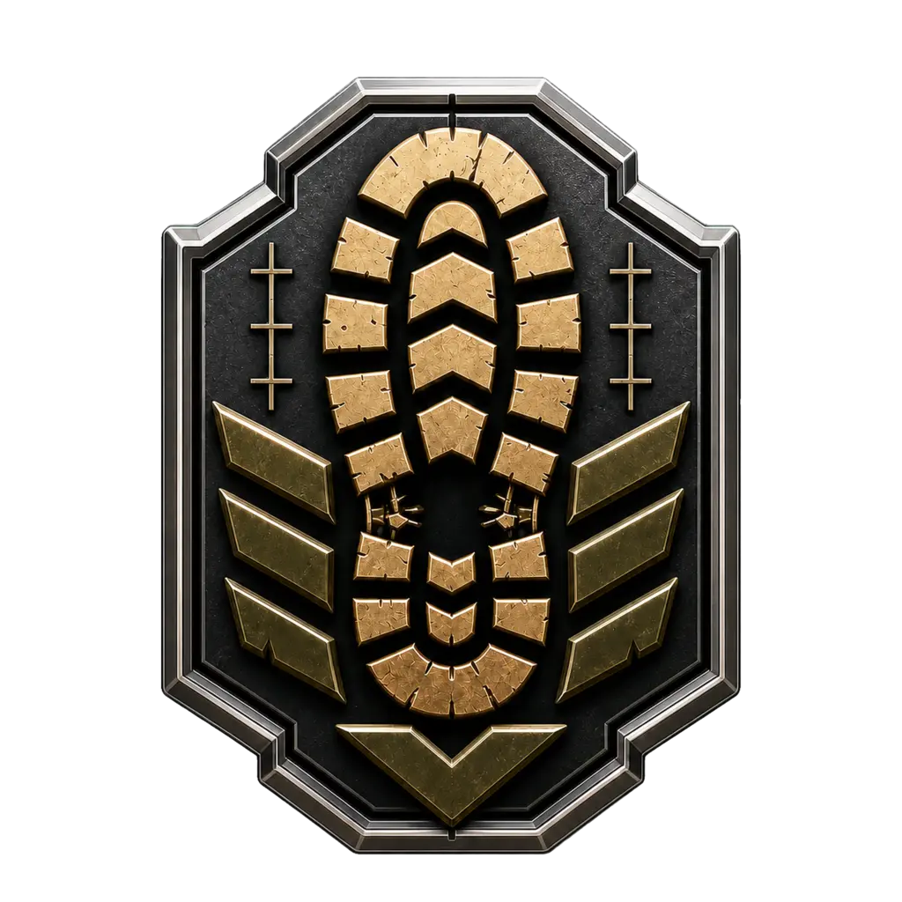
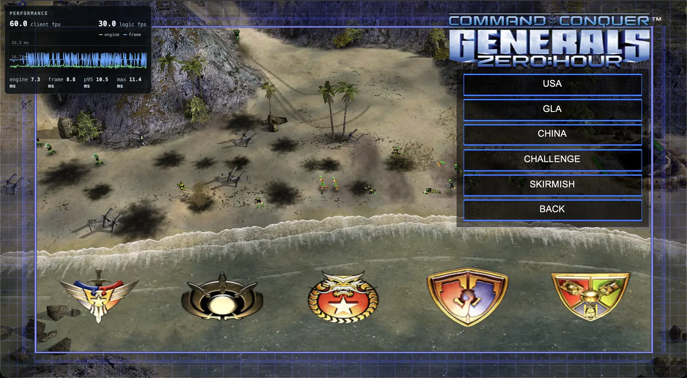
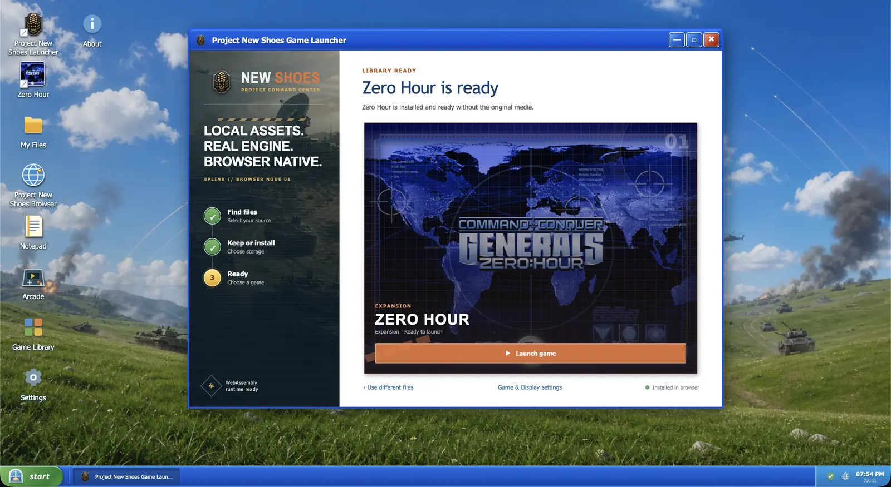

# Project New Shoes

<p align="center">
  
</p>

<p align="center"><strong>The original Command & Conquer: Generals Zero Hour engine, ported to WebAssembly.</strong></p>

Project New Shoes compiles the genuine C++ engine source in this repository to
WebAssembly and replaces its Windows device layer with browser implementations.
It is a port of the original game, not a clone or a gameplay reimplementation.

The project is independent, modified software. It is not affiliated with,
endorsed by, or supported by Electronic Arts. Retail game data is not included;
players must provide files from a copy they own.

## Play

**[Play Project New Shoes](https://newshoes.gg/)**

This public URL points to the current GitHub Pages deployment.

<p align="center">
  <br>
  
</p>

<p align="center"><em>Retail game data shown in these screenshots was supplied locally for testing. No game archives or reusable extracted assets are bundled with this repository.</em></p>

## Status

This is a playable development build, not a finished release. The current
threaded runtime:

- completes the original Zero Hour engine initialization path;
- renders the shell, menus, terrain, objects, effects, and playable skirmishes
  through WebGL2;
- uses translated D3D8 vertex and pixel shaders by default, with the classic
  fixed-function path still available;
- routes Miles-style audio calls to Web Audio;
- imports required data from original media or an existing installation into
  browser-local OPFS storage;
- accepts the original mouse and keyboard input paths;
- has save persistence and a short four-player WebRTC match gate; and
- can close and relaunch from the browser desktop.

Fidelity, campaigns, video, natural gameplay audio coverage, long multiplayer
sessions, save/load coverage, performance, and browser compatibility still need
work. Chrome and Chromium are the primary tested browsers. Firefox and Safari
are not yet release targets.

## What you need

The runtime currently requires a desktop Chromium browser with WebGL2,
`SharedArrayBuffer`, cross-origin isolation, and Origin Private File System
support. Localhost is sufficient for development. A LAN or hosted deployment
must use HTTPS and send the required COOP/COEP headers; see the
[deployment guide](WebAssembly/DEPLOYMENT.md).

You also need both Generals and Zero Hour retail data. The launcher supports two
ownership paths:

1. **Installed digital copy:** choose the game root folder containing the
   Generals and Zero Hour data.
2. **Original media:** choose the complete Generals and Zero Hour disc or ISO
   set. Multi-disc releases must be selected together.

The collection is currently sold through the official
[Steam bundle](https://store.steampowered.com/bundle/39394/Command_Conquer_The_Ultimate_Collection/)
and the [EA app](https://www.ea.com/games/command-and-conquer/command-and-conquer-the-ultimate-collection).
Existing original discs are also supported.

Selection and extraction happen locally. The launcher reads ISO 9660 and
MODE1/2352 images, extracts the required Cabinet members, validates the BIG
archives, and stores the installed runtime in OPFS. It does not upload or
redistribute the selected data. Details are in
[WebAssembly/ASSETS.md](WebAssembly/ASSETS.md).

## Architecture

The original source already separates portable game systems from platform
devices. The port keeps that boundary.

```text
GeneralsMD/Code/GameEngine
  simulation, AI, scripts, INI, UI, objects, weapons, netcode
                         |
                         v
GeneralsMD/Code/GameEngineDevice and Libraries
  DirectX 8, Win32, Miles, Bink, GameSpy platform boundaries
                         |
                         v
WebAssembly browser platform
  pthread worker + OffscreenCanvas
  D3D8 and SM1 shaders -> WebGL2
  Miles API -> Web Audio
  Win32 input/time/files -> DOM, Emscripten, OPFS
  UDP/LAN transport -> WebRTC with WebSocket signaling
```

The shipping play path runs the engine on an Emscripten pthread. Rendering uses
an `OffscreenCanvas`, so the browser main thread stays responsive while the
original engine performs synchronous work. User-owned archives are streamed to
OPFS. The worker opens synchronous access handles and presents the original
filesystem code with its expected blocking read interface, without copying the
whole game into the JavaScript heap.

The D3D8 bridge has two rendering tiers:

- **Enhanced**, the default, translates the shipped shader model 1.1 vertex and
  pixel shaders to GLSL ES.
- **Classic** emulates the fixed-function D3D8 pipeline with generated shaders.

The launcher and game share a same-origin browser desktop. The launcher owns
media selection, installation, settings, diagnostics, and lifecycle. The game
runtime owns the original engine state. The Playwright harness drives both
through `window.CnCPort.rpc(...)` and verifies state plus canvas screenshots.

## Repository layout

```text
Generals/             EA's original Generals source
GeneralsMD/           EA's original Zero Hour source, the primary target
WebAssembly/
  CMakeLists.txt      Emscripten build graph
  shims/              Win32, DirectX, and compiler compatibility
  src/                browser platform and engine boundary code
  harness/            launcher, play page, RPC bridge, and browser tests
  tools/              build, archive extraction, and verification tools
PROJECT.md            architecture and roadmap
AGENTS.md              current coding-agent policy
CLAUDE.md              symlink to AGENTS.md
archive/               frozen port-era TODO and completion history
```

Generated builds, browser profiles, screenshots, extracted archives, and retail
media are ignored.

## Build and run

The pinned toolchain is Emscripten 3.1.6. You also need Node.js, npm, CMake, and
Ninja. Asset extraction tools additionally use 7-Zip.

```sh
# Activate emsdk 3.1.6 first.
cd WebAssembly
npm install
npm run build:port:threaded:release
npm run serve:harness
```

Open:

```text
http://127.0.0.1:8080/harness/play.html
```

The local launcher will ask for the original installation folder or complete
media set. The first run can take several minutes while it validates and stores
roughly 2.1 GB of game archives.

Useful verification commands:

```sh
npm run build:port
npm run test:startup-vertical
npm run test:skirmish-start
npm run verify:threaded-play
```

`npm run build:port` is the normal iteration build. `npm run build:wasm`
rebuilds the large legacy smoke surface and is intended for broader regression
runs. Several asset-backed tests require ignored local retail data; a missing
asset fixture is not permission to commit it.

More detail is in [WebAssembly/README.md](WebAssembly/README.md).

## Automation and supervision

This port was developed mostly by autonomous coding agents with limited human
supervision. Agustin Aguilar set the direction, supplied local test media,
performed hands-on playtests, chose tradeoffs, and integrated the work. Agents
scouted the source, implemented ports, ran browser harnesses, captured GPU
evidence, reviewed changes, and updated the project history.

At the public-readiness audit snapshot, the reachable history records work by
the following model families. Aliases were consolidated only when the commit
metadata named the same provider and model:

| Provider and model family | Authored commits |
|---|---:|
| OpenAI GPT-5 Codex, including Codex CLI | 1,009 |
| Z.ai GLM-5.2, through OpenCode and Pi workers | 170 |
| Anthropic Claude Fable 5 | 121 |
| Anthropic Claude Opus 4.8 | 48 |
| Anthropic Claude (model unspecified in metadata) | 3 |
| Qwen 3.6 27B and 35B variants | 30 |
| Mistral Medium 3.5 | 17 |
| DeepSeek V4 Pro | 1 |

Agustin and the upstream EA import author, LFeenanEA, are listed separately in
the audit. These counts describe commit metadata, not relative contribution
quality. The reproducible audit method and complete alias inventory are in
[docs/public-readiness-audit.md](docs/public-readiness-audit.md).

## Contributing

Development architecture and build details are in [PROJECT.md](PROJECT.md) and
[WebAssembly/README.md](WebAssembly/README.md). The retired port-era checklists
remain available as frozen history under [`archive/`](archive/). Pull requests
and reproducible bug reports are welcome.

## Source, assets, and license

The `Generals/` and `GeneralsMD/` trees come from Electronic Arts' official
source release. The repository is licensed under GPL v3 with EA's additional
GPL section 7 terms. Read [LICENSE.md](LICENSE.md), especially the trademark,
origin, modified-version, and full no-warranty terms. This modified software is
provided as-is, without warranty, to the fullest extent permitted by law.

The repository does not grant rights to Command & Conquer trademarks or retail
game data. Seven small `RequiredAssets` paths already present in EA's source
tree—four asset-format files and three auxiliary INI/TBL files—are part of that
upstream release and are duplicated between the Generals and Zero Hour trees.
Project launcher artwork is
documented under
[WebAssembly/harness/assets](WebAssembly/harness/assets/README.md). Original
BIG archives, maps, textures, models, music, speech, movies, disc images, and
installed game payloads must remain local and untracked.
